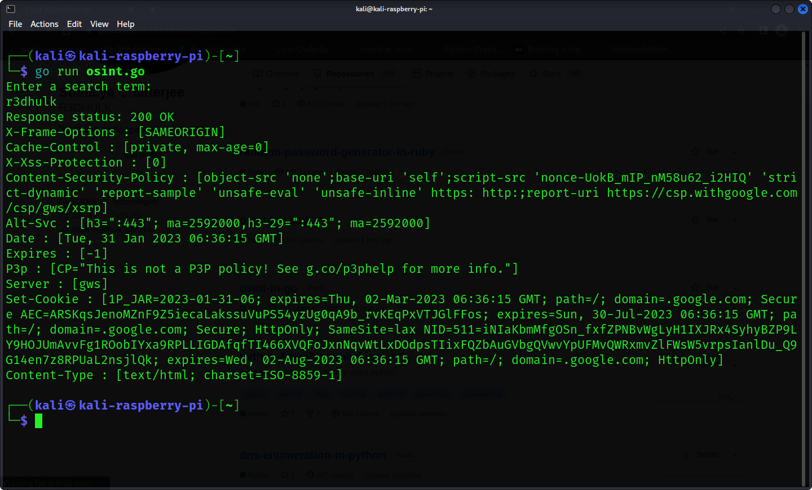

<h1><b>Osint In Go</b></h1>
<h1><b>What Is Osint?</b></h1>
<h2><i>Open-source intelligence is the collection and analysis of data gathered from open sources to produce actionable intelligence.</h1></i>

#
  </a>

#
<h2><b> 😇 Author: Sumalya Chatterjee </b></h2>

#
<h1><b>❤️ Don't Copy, Do Fork 😊</b></h1>

#

<h1><b>Result of This Tool 👇</b></h1>



#

<h1><b>Git Installation </h1></b>

```
# Install Git
sudo apt install git

# Install Go
sudo apt install golang

# Git Clone
git clone https://github.com/R3DHULK/osint-in-go

# Change Directory
cd osint-in-go

# Run This Tool To Find Subdomains On Target Networks
go run osint.go

```
#
<h2><b><i> Show Support 👇👇👇</b></i> </h2>
<a href="https://www.buymeacoffee.com/r3dhulk"> </a><br><br>

